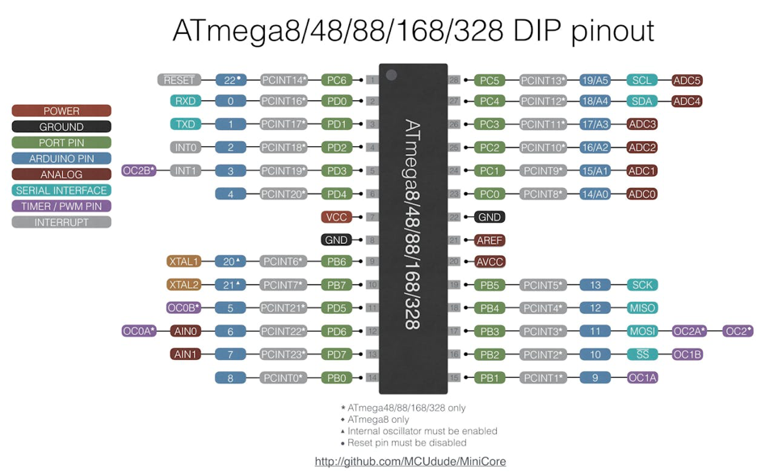

# ESP32
## Links
[Ebay Link](https://www.ebay.de/itm/255283221996)

[Pinout](https://www.studiopieters.nl/esp32-pinout/)

[Usable Pins](https://www.upesy.com/blogs/tutorials/esp32-pinout-reference-gpio-pins-ultimate-guide#ddc2b06a7198495bb23488e58fa5d271)

[How to use PWM](https://www.upesy.com/blogs/tutorials/how-to-use-pwm-on-esp32-with-examples#ebece786f48246e4998b27a6523154d1)

[BLE Info for ESP32](https://randomnerdtutorials.com/esp32-bluetooth-low-energy-ble-arduino-ide/)

[BLE Setup](https://randomnerdtutorials.com/esp32-ble-server-client/)

[BLE docs](https://www.bluetooth.com/wp-content/uploads/Files/Specification/HTML/Assigned_Numbers/out/en/Assigned_Numbers.pdf?v=1718748890361)

[Fix uploading timeout](https://randomnerdtutorials.com/solved-failed-to-connect-to-esp32-timed-out-waiting-for-packet-header/)

[Setting up PlatformIO](https://randomnerdtutorials.com/vs-code-platformio-ide-esp32-esp8266-arduino/)

[Finding ESP32 version](https://forum.dronebotworkshop.com/esp32-esp8266/what-version-of-esp32-do-i-have/)

# Atmega
## Pinout

